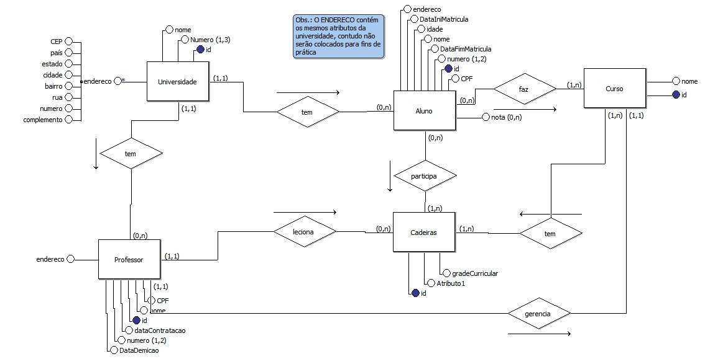

# Sistema Acadêmico

Software que simula um Sistema Acadêmico de uma universidade.  

## Modelo Relacional:

## 🛠️Ferramentas:

- MySQL
- Java

## Funcinalidades Pretendidas:

- Cadastro de Professores e Alunos
- Login
- Inserção de notas exclusivas para Professores
- Alunos terem acesso as suas notas e suas estatísticas
- Mais...
